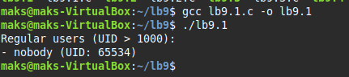
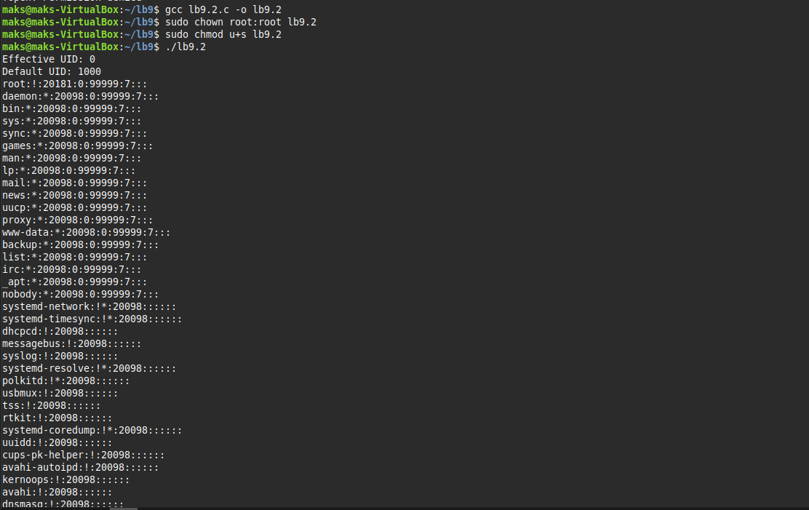
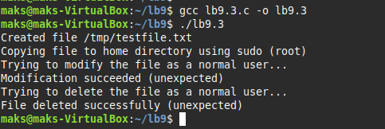
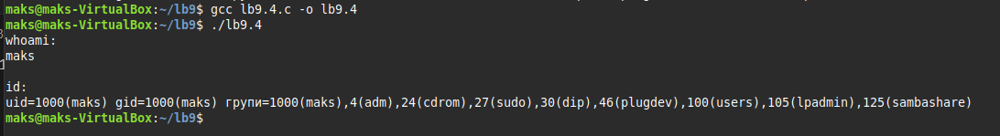
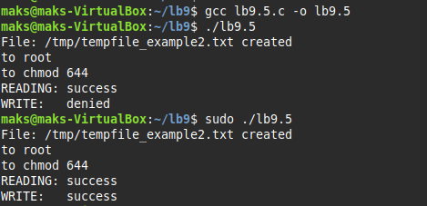
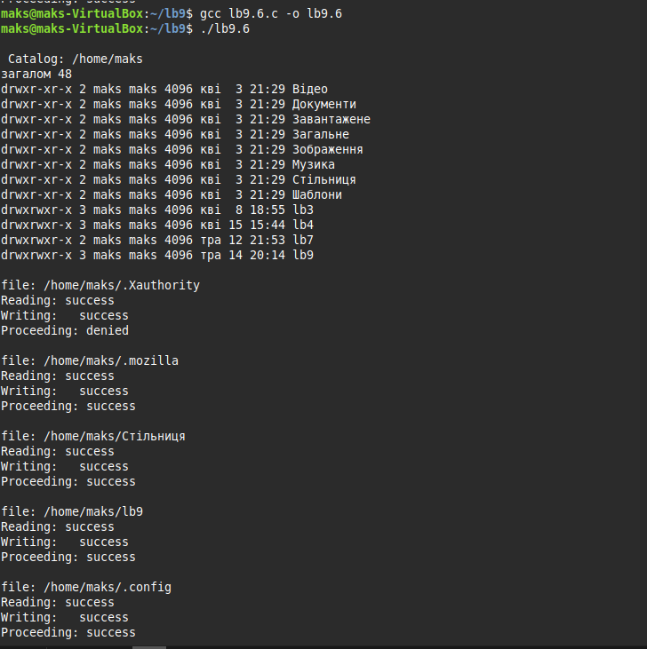
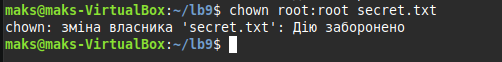
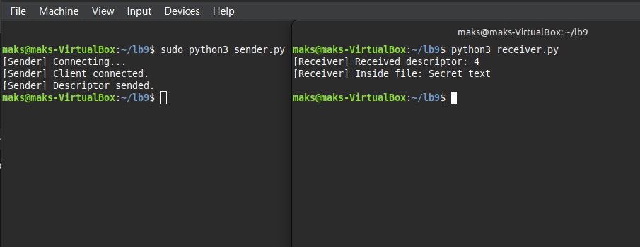

# Лабораторна робота №9

## Завдання 1

```c
#include <stdio.h>
#include <stdlib.h>
#include <string.h>
#include <unistd.h> 

#define UID_THRESHOLD 1000
#define LINE_LEN 1024

int main() {
    FILE *fp = popen("getent passwd", "r");
    if (!fp) {
        perror("popen");
        return 1;
    }

    char line[LINE_LEN];
    char *username;
    int uid;
    int current_uid = getuid();

    printf("Regular users (UID > %d):\n", UID_THRESHOLD);

    while (fgets(line, sizeof(line), fp)) {
        char *saveptr;
        username = strtok_r(line, ":", &saveptr);
        strtok_r(NULL, ":", &saveptr);
        char *uid_str = strtok_r(NULL, ":", &saveptr);  

        if (uid_str) {
            uid = atoi(uid_str);
            if (uid >= UID_THRESHOLD && uid != current_uid) {
                printf("- %s (UID: %d)\n", username, uid);
            }
        }
    }

    pclose(fp);
    return 0;
}
```
Вивід:



Цей "nobody" user з'являється тоді, коли треба запускати якісь процеси, які не потребують жодних прав.

## Завдання 2

Потрібно написати програму, яка виконує адмін. команду без адмін. прав.

Протестуємо цю команду з рут-правами:



Тепер напишемо програму, яка буде виводити цю команду не потребуючи рут-прав використовуючи ```setuid root``` - дозволяє запускати програму звичайним користувачем, але з привілеями root, якщо сам файл має біт setuid і належить користувачу root.
```c
#include <stdio.h>
#include <stdlib.h>
#include <unistd.h>

int main() {
    printf("Effective UID: %d\n", geteuid());
    printf("Default UID: %d\n", getuid());

    FILE *f = fopen("/etc/shadow", "r");
    if (f == NULL) {
        perror("fopen");
        return 1;
    }

    char line[256];
    while (fgets(line, sizeof(line), f)) {
        printf("%s", line);
    }

    fclose(f);
    return 0;
}
```

Запускаємо:


Вивід такий сами, як і через ```sudo```.

## Завдання 3

```c
#include <stdio.h>
#include <stdlib.h>
#include <unistd.h>
#include <fcntl.h>
#include <pwd.h>
#include <sys/stat.h>

int main() {
    const char *orig_file = "/tmp/testfile.txt";
    struct passwd *pw = getpwuid(getuid());
    const char *home = pw->pw_dir;
    char dest_file[512];
    snprintf(dest_file, sizeof(dest_file), "%s/testfile_copy.txt", home);

    FILE *f = fopen(orig_file, "w");
    if (!f) {
        perror("Cannot create file");
        return 1;
    }
    fprintf(f, "Original content\n");
    fclose(f);
    printf("Created file %s\n", orig_file);

    printf("Copying file to home directory using sudo (root)\n");
    char cmd[1024];
    snprintf(cmd, sizeof(cmd), "sudo cp %s %s", orig_file, dest_file);
    system(cmd);

    snprintf(cmd, sizeof(cmd), "sudo chown %s:%s %s", pw->pw_name, pw->pw_name, dest_file);
    system(cmd);

    snprintf(cmd, sizeof(cmd), "chmod u+rw %s", dest_file);
    system(cmd);

    printf("Trying to modify the file as a normal user...\n");
    f = fopen(dest_file, "a");
    if (!f) {
        perror("Cannot modify file");
    } else {
        fprintf(f, "User modification attempt\n");
        fclose(f);
        printf("Modification succeeded (unexpected)\n");
    }

    printf("Trying to delete the file as a normal user...\n");
    if (remove(dest_file) != 0) {
        perror("Cannot delete file");
    } else {
        printf("File deleted successfully (unexpected)\n");
    }

    return 0;
}
```

Компілюємо й запускаємо:



Програма очікувала відмову, але користувач успішно модифікував і видалив файл. Тобто, створився файл ```/tmp/testfile.txt```, потім скопіювали його в домашній каталог (```/home/maks/```) з правами root. Але копія залишилась у нашій власності або з правами, що дозволяють нам її змінити.

## Завдання 4
```c
#include <stdio.h>
#include <stdlib.h>

int main() {
    printf("whoami: \n");
    int status1 = system("whoami");
    if (status1 == -1) {
        perror("error whoami");
        return 1;
    }

    printf("\nid: \n");
    int status2 = system("id");
    if (status2 == -1) {
        perror("error id");
        return 1;
    }

    return 0;
}
```

Програма по черзі викликає ```whoami``` та ```id``` з групами:



## Завдання 5

Потрібно написати програму, яка створює тимчасовий файл від імені звичайного користувача. Потім від імені суперкористувача використовує команди chown і chmod, щоб змінити тип володіння та права доступу.

```c
#include <stdio.h>
#include <stdlib.h>
#include <unistd.h>
#include <fcntl.h>

int can_read(const char *filename) {
    	return access(filename, R_OK) == 0;
}

int can_write(const char *filename) {
    	return access(filename, W_OK) == 0;
}

int main() {
	const char *filename = "/tmp/tempfile_example2.txt";

    	FILE *fp = fopen(filename, "w");
    	if (!fp) {
        	perror("file");
        	return 1;
    	}
	fprintf(fp, "Temporary file");
	fclose(fp);
	printf("File: %s created\n", filename);

    	printf("to root\n");
    	char cmd[256];
    	snprintf(cmd, sizeof(cmd), "sudo chown root %s", filename);
    	system(cmd);

    	printf("to chmod 644\n");
    	snprintf(cmd, sizeof(cmd), "sudo chmod 644 %s", filename);
    	system(cmd);

    	printf("READING: %s\n", can_read(filename) ? "success" : "denied");
    	printf("WRITE:   %s\n", can_write(filename) ? "success" : "denied");

    	return 0;
}
```

Ця програма по черзі виконує системні команди та визначає в яких випадках вона може виконувати читання та запис файлу.



Як бачимо, запис дозволено тільки з рут-правами.

## Завдання 6

Потрібно написати програму, яка імітує ```ls -l```, щоб переглянути власника і права доступу до файлів у своєму домашньому каталозі, в ```/usr/bin``` та в ```/etc```.

```c
#include <stdio.h>
#include <stdlib.h>
#include <unistd.h>
#include <dirent.h>
#include <string.h>
#include <sys/stat.h>
#include <pwd.h>

void list_directory(const char *path) {
    printf("\n Catalog: %s\n", path);
    char cmd[256];
    snprintf(cmd, sizeof(cmd), "ls -l %s", path);
    system(cmd);
}

void check_access(const char *path) {
    DIR *dir = opendir(path);
    if (!dir) {
        perror("opendir");
        return;
    }

    struct dirent *entry;
    char fullpath[512];

    int count = 0;
    while ((entry = readdir(dir)) != NULL && count < 5) {
        if (strcmp(entry->d_name, ".") == 0 || strcmp(entry->d_name, "..") == 0)
            continue;

        snprintf(fullpath, sizeof(fullpath), "%s/%s", path, entry->d_name);

        printf("\nfile: %s\n", fullpath);
        printf("Reading: %s\n", access(fullpath, R_OK) == 0 ? "success" : "denied");
        printf("Writing:   %s\n", access(fullpath, W_OK) == 0 ? "success" : "denied");
        printf("Proceeding: %s\n", access(fullpath, X_OK) == 0 ? "success" : "denied");

        count++;
    }

    closedir(dir);
}

int main() {
    const char *home = getenv("HOME");

    const char *paths[] = {
        home,
        "/usr/bin",
        "/etc"
    };

    for (int i = 0; i < 3; i++) {
        list_directory(paths[i]);
        check_access(paths[i]);
    }

    return 0;
}
```

Вивід:



Як бачимо, програма переглядає вміст каталогу, Перевірку доступу (читання/запис/виконання) до перших 5 файлів кожного з них та перевірку домашнього каталогу користувача та системних директорій (```/usr/bin```, ```/etc```)

## Завдання по варіанту(10)

В моєму завданні мені потрібно визначити, які приховані механізми можуть дати доступ до закритого ресурсу без зміни прав доступу.

В інтернеті є багато різних гайдів, як обійти доступ до закритих ресурсів. Мені трапилася техніка передачі файлового дескриптора між процесами через UNIX-сокет. Тобто, є два файли:
1. Sender - Створює UNIX-сокет, очікує підключення клієнта, відкриває файл, який нам потрібно отримати без рут-прав ```secret.txt``` і передає дескриптор файлу через сокет.
2. Receiver - Підключається до того ж UNIX-сокета, отримує повідомлення разом із дескриптором файлу і читає вміст файлу через отриманий дескриптор.

Простими словами - це два процеси, які спілкуються між собою через локальний сокет(файл ```/tmp/socket_example```) і передають не файл, а дескриптор файлу("посилання" або "ключ" до вже відкритого файлу).

Дескриптор - число, яке операційна система видає, коли ви відкриваєте файл. Наприклад:
```python
fd = os.open("secret.txt", os.O_RDONLY)
```

Тепер, створюємо [текстовий документ](secret.txt), який доступний для читання лише рут-користувачам і запускаємо обидва файли:

Закриття secret.txt:



Читання заблокованого тексту із звичайного користувача:


Ми отримали текст, який містився у файлі.
